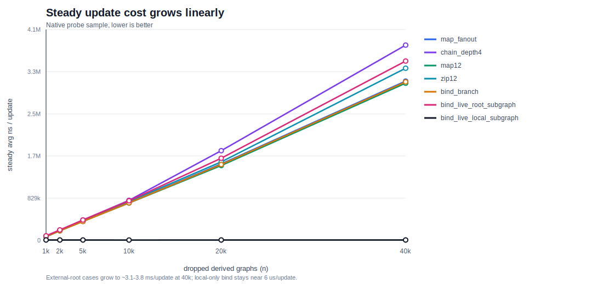
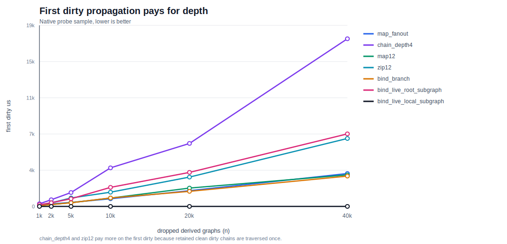
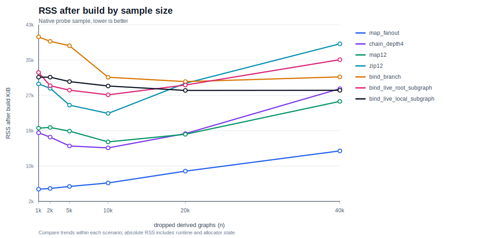

# Dirty Retention Probe

Native-only probe for retained dirty subscriptions in `username/acyclic`.

## What It Measures

This is not the old cycle leak. The graph can be acyclic and still retain dead
dirty metadata:

```text
child ---derived---> parent

node(parent) ----ref----> node(child)
    |                       |
   ref                     ref
    |                       |
    v                       v
dirty(parent) <---ref--- dirty(child).parents
```

After `node(parent)` is dropped, `dirty(parent)` can remain reachable from
`dirty(child).parents` until `child` is released. LeakSanitizer may not report
this because the metadata is still reachable from a live root.

Key metrics:

| Metric | Meaning |
| --- | --- |
| `rss_delta_kb` | Resident Set Size (RSS) change after creating and dropping derived graphs. Noisy; use as rough memory signal only. |
| `first_dirty_us` | First root update after dropping derived graphs. Captures retained clean dirty-chain traversal. |
| `steady_avg_ns` | Average root update after retained dirty flags are already dirty. Best signal for stale-edge scan cost. |

## Run

```sh
moon run --target native dirty_retention_probe
```

Refresh charts from a new run:

```sh
moon run --target native dirty_retention_probe | python3 dirty_retention_probe/render_charts.py
```

## Scenarios

| Scenario | Shape |
| --- | --- |
| `baseline_ephemeral` | Creates input + derived pairs where the root is also short-lived. This estimates ordinary allocation noise. |
| `map_fanout` | One long-lived root, many short-lived `map` outputs. |
| `chain_depth4` | One long-lived root, many dropped four-node map chains. First dirty walks the retained chain; steady-state updates mostly scan the root's immediate stale parents. |
| `map12` | Twelve long-lived roots feeding one short-lived `map12` output. |
| `zip12` | Twelve long-lived roots feeding `zip12(...).map(...)`, so each dropped derived graph has an extra dirty level. |
| `bind_branch` | Long-lived selector/branch roots feeding dropped `bind` outputs. |
| `bind_live_root_subgraph` | `bind` output stays live; selector changes repeatedly replace and drop old dynamic `payload.map(...).map(...)` subgraphs that subscribe to a long-lived root. |
| `bind_live_local_subgraph` | `bind` output stays live; selector changes repeatedly replace local-only dynamic subgraphs that do not subscribe to an external root. |
| `interleaved_map_batch` | Creates batches of dropped maps and updates the root between batches, closer to UI mount/update churn. |

## Output Columns

| Column | Meaning |
| --- | --- |
| `scenario` | Scenario key listed in the Scenarios table, e.g. `map_fanout`. |
| `n` | Number of dropped derived graphs. |
| `depth` | Dirty propagation depth for the scenario. |
| `fan_in` | Number of long-lived roots that receive the dropped output's dirty flag. |
| `rss_before_kb` | Current process RSS before building dropped graphs. |
| `rss_after_build_kb` | Current process RSS after building and dropping graphs. |
| `rss_delta_kb` | `rss_after_build_kb - rss_before_kb`. |
| `first_dirty_us` | One root update when retained dirty flags are still clean. |
| `steady_total_us` | Total time for steady-state root updates. |
| `steady_iterations` | Number of steady-state updates. |
| `steady_avg_ns` | Average root update + live read time after retained dirty flags have already been marked dirty. |
| `checksum` | Prevents the benchmark body from becoming dead code and catches obvious semantic failures. |

## Charts

All three charts plot retained-root scenarios with six sample sizes.
`baseline_ephemeral` is a baseline, and `interleaved_map_batch` is a single
UI-churn data point.







## Sample Data

Captured on 2026-07-03. The probe samples six sizes:
`1k / 2.5k / 5k / 10k / 20k / 40k`.

The table below shows the largest retained-root sample. Full rows are printed
by the executable and embedded in `render_charts.py` for regenerating charts.

| Scenario | N | Depth | Fan-in | RSS After Build KiB | RSS Delta KiB | First Dirty us | Steady Avg ns/update |
| --- | ---: | ---: | ---: | ---: | ---: | ---: | ---: |
| `map_fanout` | 40,000 | 1 | 1 | 13,792 | 352 | 3,377 | 3,128,580 |
| `chain_depth4` | 40,000 | 4 | 1 | 28,224 | 11,952 | 17,196 | 3,835,725 |
| `map12` | 40,000 | 1 | 12 | 25,280 | 5,616 | 3,240 | 3,088,150 |
| `zip12` | 40,000 | 2 | 12 | 38,640 | 8,144 | 6,972 | 3,382,065 |
| `bind_branch` | 40,000 | 1 | 2 | 30,960 | 1,088 | 3,111 | 3,113,560 |
| `bind_live_root_subgraph` | 40,000 | 2 | 1 | 34,960 | 5,312 | 7,444 | 3,522,355 |
| `bind_live_local_subgraph` | 40,000 | 2 | 0 | 27,856 | 32 | 6 | 6,020 |

## Takeaways

| Observation | Result |
| --- | --- |
| Steady stale-edge scan | External-root cases are about 77-96 ns per stale immediate dirty parent in the 40k rows. |
| First dirty after drop | Higher for deeper retained dirty chains, especially `chain_depth4`, `zip12`, and `bind_live_root_subgraph`. |
| Live `bind` output | `bind_live_root_subgraph` grows linearly even when the output is not dropped. |
| Local-only dynamic subgraph | `bind_live_local_subgraph` stays near 6 us/update at 40k, so the growth needs a long-lived subscribed root. |
| RSS after build | Useful for seeing same-scenario memory trends; absolute values include runtime and allocator state. |

UI estimate:

| Stale subscriptions on one updated root | Extra time per root update |
| ---: | ---: |
| 1,000 | ~0.08 ms |
| 10,000 | ~0.8 ms |
| 100,000 | ~8 ms |

This is usually fine at low thousands. It becomes risky when render, route,
dialog, or list-item churn repeatedly creates derived nodes from long-lived
global inputs without detaching dirty subscriptions.
